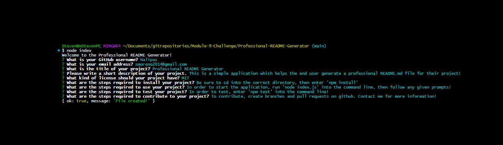

# Professional README Generator

## Description

This is a simple application which helps the end user generate a professional README.md file for their project, using a command line interface with the help of [Inquirer.js](https://www.npmjs.com/package/inquirer). 

This application gives the user a great starting point for their README.md file, from which they can add to or edit as they desire.

## Table of Contents

* [Installation](#installation)
* [Usage](#usage)
* [License](#license)
* [Contributing](#contributing)
* [Tests](#tests)
* [Questions](#questions)

## Installation

Be sure to cd into the correct directory, then enter 'npm install' into the command line.

## Usage

In order to start the application, run 'node index.js' into the command line, then follow any given prompts!

## License

## Contributing

To contribute, create branches and pull requests on github. Contact me for more information!

## Tests

In order to test, enter 'npm test' into the command line!

## Questions

If you have any questions, please feel free to reach out!

- GitHub: [Nalipas](https://github.com/Nalipas)
- Email: smoreno2014@gmail.com

